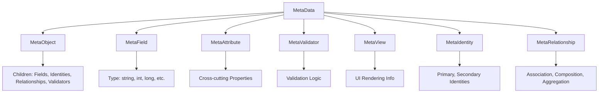

# Core Concepts

Understanding MetaObjects' core concepts is essential for effective use of the framework. This guide explains the fundamental architecture, patterns, and terminology that underpin everything in MetaObjects.

## Metadata vs Data: The Foundation

The most important distinction in MetaObjects is between **metadata** and **data**:

### :material-database-outline: **Metadata** (Schema/Structure)
Metadata defines the **structure, rules, and behavior** of your objects. Think of it as the "blueprint" or "schema."

```json title="Metadata Example (Defines Structure)"
{
  "object": {
    "name": "User",
    "subType": "pojo",
    "@dbTable": "users",
    "children": [
      {
        "field": {
          "name": "id",
          "subType": "long",
          "@dbColumn": "user_id"
        }
      },
      {
        "field": {
          "name": "email",
          "subType": "string",
          "@required": true,
          "@maxLength": 255,
          "@dbColumn": "email"
        }
      },
      {
        "identity": {
          "name": "user_pk",
          "subType": "primary",
          "@fields": ["id"],
          "@generation": "increment"
        }
      }
    ]
  }
}
```

### :material-database: **Data** (Instances/Values)
Data represents **actual instances** that conform to the metadata structure.

```json title="Data Example (Uses Structure)"
{
  "email": "john.doe@example.com",
  "firstName": "John",
  "lastName": "Doe"
}
```

!!! example "Real-World Analogy"
    - **Metadata** = Blueprint of a house (rooms, dimensions, electrical layout)
    - **Data** = Actual house built from that blueprint (furniture, occupants, decorations)

## The ClassLoader Pattern

MetaObjects follows a **ClassLoader pattern** analogous to Java's reflection system:

### :material-memory: **Loading Phase** (Startup)


- **One-time cost**: 100ms-1s during application startup
- **Heavy processing**: Parsing, validation, constraint checking
- **Permanent storage**: Metadata lives in memory for application lifetime

### :material-lightning-bolt: **Runtime Phase** (Application Lifetime)
```mermaid
graph LR
    A[Application Code] --> B[MetaObject.getField()]
    B --> C[Memory Lookup]
    C --> D[Cached Result]
```

- **Ultra-fast access**: 1-10μs for metadata lookups
- **Thread-safe reads**: No synchronization needed
- **Immutable structure**: No changes after loading

!!! tip "Performance Insight"
    Just like `java.lang.Class` objects are loaded once and cached forever, MetaObjects metadata is loaded once at startup and accessed thousands of times during runtime.

## READ-OPTIMIZED WITH CONTROLLED MUTABILITY

This is MetaObjects' core architectural pattern:

### :material-book-open: **Read-Optimized**
- **99.9% of operations** are reads (getting field info, validation rules, etc.)
- **No synchronization** required for read operations
- **Concurrent access** by unlimited threads without performance penalty

### :material-cog: **Controlled Mutability**
- **Loading phase**: Full mutability for construction and validation
- **Runtime phase**: Immutable for performance and thread safety
- **Update capability**: Atomic replacement for rare metadata updates

```java
// Runtime reads - ultra-fast, no locks
MetaField field = userMeta.getMetaField("email");  // ~1μs
String dbColumn = field.getMetaAttr("dbColumn").getValueAsString();  // ~1μs

// Updates (rare) - atomic replacement
loader.reload();  // Replaces entire metadata set atomically
```

## Core Component Hierarchy

MetaObjects uses a hierarchical component system:



### :material-package: **MetaData** (Base Class)
Common functionality for all metadata components:

- **Hierarchical structure**: Parent-child relationships
- **Attributes**: Cross-cutting properties
- **Caching**: Performance optimization
- **Validation**: Constraint enforcement

### :material-cube: **MetaObject** (Object Definitions)
Represents object structures like classes or entities:

```java
MetaObject userMeta = loader.getMetaObjectByName("User");
List<MetaField> fields = userMeta.getChildren(MetaField.class);
String dbTable = userMeta.getMetaAttr("dbTable").getValueAsString();
```

### :material-textbox: **MetaField** (Field Definitions)
Represents properties or attributes within objects:

```java
MetaField emailField = userMeta.getMetaField("email");
String fieldType = emailField.getSubTypeName();  // "string"
boolean isRequired = emailField.hasMetaAttr("required");
```

### :material-tag: **MetaAttribute** (Cross-cutting Properties)
Represents additional properties that can be attached to any metadata:

```java
MetaAttribute dbColumn = emailField.getMetaAttr("dbColumn");
String columnName = dbColumn.getValueAsString();  // "email_address"
```

### :material-key: **MetaIdentity** (Object Identity)
Defines how objects are uniquely identified, replacing the deprecated field-level approach:

```java
PrimaryIdentity userPk = userMeta.getPrimaryIdentity();
List<String> identityFields = userPk.getFieldNames();  // ["id"]
String generation = userPk.getGeneration();  // "increment"
```

### :material-link: **MetaRelationship** (Object Relationships)
Represents relationships between objects with clear semantic meaning:

```java
AssociationRelationship customerRel = orderMeta.getRelationship("customer");
String targetObject = customerRel.getTargetObject();  // "Customer"
String cardinality = customerRel.getCardinality();  // "one"
```

## Type System Architecture

MetaObjects uses a sophisticated type system:

### :material-sitemap: **Type Hierarchy**
```
Type: "field"
├── SubType: "string" → StringField
├── SubType: "int" → IntegerField
├── SubType: "long" → LongField
├── SubType: "date" → DateField
└── SubType: "custom" → Your Custom Field

Type: "object"
├── SubType: "pojo" → PojoMetaObject
├── SubType: "proxy" → ProxyMetaObject
└── SubType: "mapped" → MappedMetaObject

Type: "identity"
├── SubType: "primary" → PrimaryIdentity
└── SubType: "secondary" → SecondaryIdentity

Type: "relationship"
├── SubType: "association" → AssociationRelationship
├── SubType: "composition" → CompositionRelationship
└── SubType: "aggregation" → AggregationRelationship
```

### :material-cogs: **Provider-Based Registration**
Types are registered through a clean provider system (no annotations):

```java
public class CurrencyField extends PrimitiveField<BigDecimal> {
    public static void registerTypes(MetaDataRegistry registry) {
        registry.registerType(CurrencyField.class, def -> def
            .type("field").subType("currency")
            .inheritsFrom("field", "base")
            .description("Currency field with precision")
        );
    }
}
```

### :material-link: **Inheritance System**
Types can inherit from base types to reduce duplication:

```java
// All field types inherit common behavior from "field.base"
.inheritsFrom("field", "base")  // Gets common field attributes and constraints
```

## Constraint System

MetaObjects enforces rules through a comprehensive constraint system:

### :material-shield-check: **Constraint Types**

#### Placement Constraints
Define **what can be placed where**:

```java
// "Objects CAN optionally have dbTable attributes"
PlacementConstraint dbTableConstraint = new PlacementConstraint(
    "object.database.table",
    "Objects can optionally have dbTable attribute",
    metadata -> metadata instanceof MetaObject,
    child -> child instanceof StringAttribute &&
             "dbTable".equals(child.getName())
);
```

#### Validation Constraints
Define **what values are valid**:

```java
// "Field names must follow identifier pattern"
ValidationConstraint namingPattern = new ValidationConstraint(
    "field.naming.pattern",
    "Field names must follow identifier pattern",
    metadata -> metadata instanceof MetaField,
    (metadata, value) -> {
        String name = metadata.getName();
        return name.matches("^[a-zA-Z][a-zA-Z0-9_]*$");
    }
);
```

### :material-lightning-bolt: **Real-Time Enforcement**
Constraints are enforced automatically during metadata construction:

```java
// This will fail immediately if constraints are violated
MetaField invalidField = new MetaField("invalid::name");  // ❌ Contains ::
MetaObject user = new MetaObject("User");
user.addMetaField(invalidField);  // ❌ Constraint violation detected here
```

## Memory Management & OSGi

MetaObjects is designed for enterprise environments with sophisticated memory management:

### :material-memory: **Dual Cache Strategy**
```java
// Permanent cache - strong references for core metadata
Map<String, Object> permanentCache = new ConcurrentHashMap<>();

// Computed cache - weak references for derived values
Map<Object, Object> computedCache = Collections.synchronizedMap(new WeakHashMap<>());
```

### :material-sync: **OSGi Bundle Lifecycle**
- **ServiceLoader discovery** for dynamic type registration
- **WeakReference patterns** allow bundle classloader cleanup
- **Service registry integration** for enterprise service management

### :material-speedometer: **Performance Characteristics**
- **Startup cost**: 100ms-1s (one-time investment)
- **Runtime reads**: 1-10μs (cached, concurrent)
- **Memory footprint**: 10-50MB (permanent residence)
- **Concurrent readers**: Unlimited (no contention)

## Loading vs Runtime Phases

Understanding the two distinct phases is crucial:

### :material-upload: **Loading Phase** (Application Startup)
```java
// Heavy operations acceptable here
SimpleLoader loader = new SimpleLoader("metadata");
loader.setSourceURIs(sources);
loader.init();  // Expensive: parsing, validation, constraint checking
```

**Characteristics:**
- **Mutability**: Objects can be modified and validated
- **Synchronization**: Thread safety through explicit locking
- **Validation**: Full constraint enforcement
- **Performance**: Optimized for correctness, not speed

### :material-download: **Runtime Phase** (Application Lifetime)
```java
// Ultra-fast operations expected here
MetaObject user = loader.getMetaObjectByName("User");     // ~1μs
MetaField email = user.getMetaField("email");             // ~1μs
String pattern = email.getMetaAttr("pattern").getValueAsString();  // ~1μs
```

**Characteristics:**
- **Immutability**: Objects cannot be modified
- **Thread Safety**: No synchronization needed
- **Caching**: Aggressive caching for performance
- **Performance**: Optimized for speed, microsecond access

## Framework Integration Patterns

MetaObjects integrates with frameworks without forcing dependencies:

### :material-spring: **Spring Integration** (Optional)
```java
// Service wrapper approach
@Autowired
private MetaDataService metaDataService;

Optional<MetaObject> userMeta = metaDataService.findMetaObjectByNameOptional("User");
```

### :material-cogs: **Plain Java** (Core)
```java
// Direct loader access
MetaDataLoader loader = new SimpleLoader("metadata");
MetaObject userMeta = loader.getMetaObjectByName("User");
```

### :material-puzzle: **OSGi Bundles** (Enterprise)
```java
// Service registry access
ServiceRegistry registry = ServiceRegistryFactory.getDefault();
MetaDataLoaderRegistry loaderRegistry = new MetaDataLoaderRegistry(registry);
```

## Extension Points

MetaObjects is designed for extensibility:

### :material-code-tags: **Custom Field Types**
Create domain-specific field types:

```java
public class EmailField extends StringField {
    // Automatic email validation and formatting
}
```

### :material-wrench: **Custom Generators**
Create custom code generators:

```java
public class RestControllerGenerator extends BaseGenerator {
    // Generate Spring REST controllers from metadata
}
```

### :material-shield: **Custom Constraints**
Define business-specific validation rules:

```java
public class BusinessRuleConstraint implements ValidationConstraint {
    // Custom business logic validation
}
```

## What Makes MetaObjects Unique

### :material-rocket: **Performance First**
Unlike traditional metadata frameworks that treat metadata as data, MetaObjects treats it like Java's Class system - loaded once, read forever.

### :material-puzzle-outline: **Truly Modular**
Each module can be used independently. Need just constraint validation? Use metadata module. Need code generation? Add codegen modules.

### :material-cog-outline: **Enterprise Ready**
Built for production environments with OSGi support, memory management, and high-concurrency read patterns.

### :material-code-braces: **Developer Friendly**
Clean APIs, comprehensive validation, excellent error messages, and type safety throughout.

## Next Steps

Now that you understand the core concepts, explore specific areas:

<div class="grid cards" markdown>

-   :material-database:{ .lg .middle } **Metadata System**

    ---

    Deep dive into metadata definition and management

    [:octicons-arrow-right-24: Metadata Foundation](../user-guide/metadata/metadata-foundation.md)

-   :material-code-tags:{ .lg .middle } **Code Generation**

    ---

    Learn about template-based code generation

    [:octicons-arrow-right-24: Generator Architecture](../user-guide/codegen/generator-architecture.md)

-   :material-spring:{ .lg .middle } **Spring Integration**

    ---

    Framework integration patterns and best practices

    [:octicons-arrow-right-24: Spring Integration](../developer-guide/integration/spring-integration.md)

-   :material-memory:{ .lg .middle } **Performance**

    ---

    Understanding the memory model and optimization

    [:octicons-arrow-right-24: Performance Guide](../developer-guide/performance/performance-characteristics.md)

</div>

---

Ready to dive deeper? Continue with the [Metadata Foundation](../user-guide/metadata/metadata-foundation.md) to understand the complete metadata system!