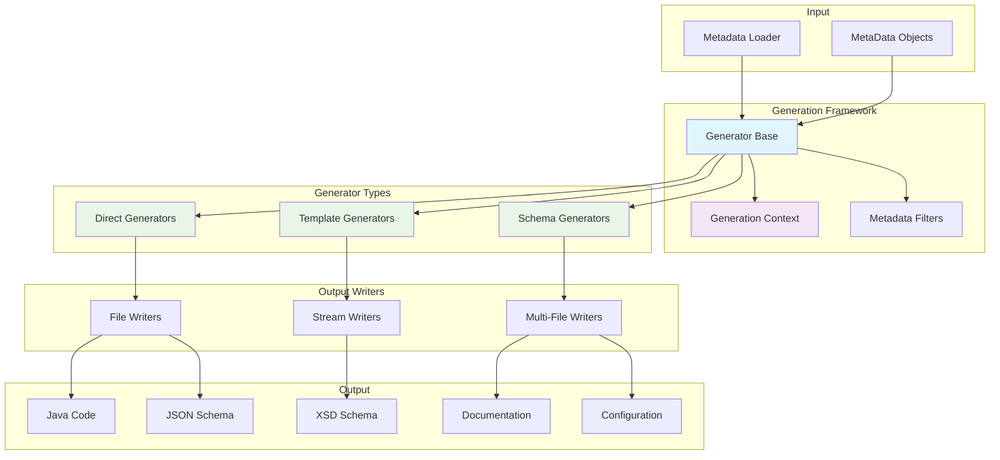

# Code Generation Architecture

The MetaObjects code generation framework provides a sophisticated, extensible system for generating code, documentation, and configuration files from metadata definitions. The framework follows a plugin-based architecture that supports multiple output formats and target languages while maintaining type safety and performance.

## Overview

The code generation system is built on a **generator pattern** that separates concerns between generation logic, output formatting, and content creation:



## Core Architecture Components

### GeneratorBase: Foundation Class

All generators inherit from `GeneratorBase`, which provides common functionality:

```java
public abstract class GeneratorBase implements Generator {
    // Core argument handling
    public static String ARG_OUTPUTDIR = "outputDir";
    public static String ARG_OUTPUTFILENAME = "outputFilename";

    private Map<String, String> args = new HashMap<>();
    private MetaDataFilters filters = new MetaDataFilters();
    private List<String> scripts = new ArrayList<>();

    // Configuration methods
    public GeneratorBase setArgs(Map<String, String> argMap);
    public GeneratorBase setFilters(List<String> filters);
    public GeneratorBase setScripts(List<String> scripts);

    // Utility methods
    protected String getArg(String name);
    protected String getArg(String name, String defaultValue);
    protected String getArg(String name, boolean required);
    protected File getOutputDir();
    protected MetaDataFilters getMetaDataFilters();
}
```

#### Key Capabilities

**Argument Management:**
```java
// Configure generator with arguments
Map<String, String> args = Map.of(
    "outputDir", "target/generated-sources",
    "outputFilename", "User.java",
    "packagePrefix", "com.example.model",
    "namePrefix", "Generated"
);
generator.setArgs(args);
```

**Metadata Filtering:**
```java
// Filter which metadata to process
List<String> filters = Arrays.asList(
    "type:object",           // Only objects
    "subType:pojo",          // Only POJO objects
    "name:User|Product",     // Specific names
    "package:com.example.*"  // Package pattern
);
generator.setFilters(filters);
```

**Output Management:**
```java
// Automatic directory creation and file handling
File outputDir = generator.getOutputDir(); // Creates if doesn't exist
String filename = generator.getOutputFilename();
```

### DirectGeneratorBase: Direct Generation Pattern

Direct generators produce output directly without template engines:

```java
public abstract class DirectGeneratorBase extends GeneratorBase {

    @Override
    public DirectGeneratorBase setScripts(List<String> scripts) {
        throw new GeneratorException("Direct generators don't support scripts");
    }

    protected void parseArgs() {
        if (!hasArg(ARG_OUTPUTDIR)) {
            throw new GeneratorException("Output directory required");
        }
    }
}
```

#### Generator Hierarchy

**Single File Generators:**
```java
// Generate one output file from all metadata
public abstract class SingleFileDirectGeneratorBase extends DirectGeneratorBase {

    @Override
    public final void execute(MetaDataLoader loader) throws GeneratorException {
        parseArgs();

        try (OutputStream os = createOutputStream()) {
            generateContent(loader, os);
        } catch (IOException e) {
            throw new GeneratorIOException("Failed to generate output", e);
        }
    }

    protected abstract void generateContent(MetaDataLoader loader, OutputStream os);
}
```

**Multi-File Generators:**
```java
// Generate multiple output files (one per metadata object)
public abstract class MultiFileDirectGeneratorBase extends DirectGeneratorBase {

    @Override
    public final void execute(MetaDataLoader loader) throws GeneratorException {
        parseArgs();

        Collection<MetaData> items = getFilteredMetaData(loader);
        for (MetaData item : items) {
            generateFileForItem(loader, item);
        }
    }

    protected abstract void generateFileForItem(MetaDataLoader loader, MetaData item);
}
```

## Generation Context System

The generation context provides stateful information during code generation:

### BaseGenerationContext

Provides common functionality for all generation contexts:

```java
public abstract class BaseGenerationContext<T extends MetaData> {
    protected final MetaDataLoader loader;
    protected final Map<String, Object> properties = new HashMap<>();
    protected final Map<String, Object> cache = new HashMap<>();

    // Generation state
    protected T currentItem;
    protected String currentPackage;
    protected String currentClassName;
    protected final Set<String> imports = new LinkedHashSet<>();

    // Property management
    public BaseGenerationContext<T> setProperty(String key, Object value);
    public <V> V getProperty(String key, V defaultValue);

    // State management
    public BaseGenerationContext<T> setCurrentItem(T item);
    public BaseGenerationContext<T> setCurrentPackage(String packageName);
    public BaseGenerationContext<T> addImport(String importName);

    // Cache management
    public BaseGenerationContext<T> putCache(String key, Object value);
    public <V> V getCache(String key);
}
```

### Specialized Contexts

**Object Generation Context:**
```java
public class GenerationContext extends BaseGenerationContext<MetaObject> {
    private MetaField currentField;

    // Object-specific methods
    public GenerationContext setCurrentObject(MetaObject object);
    public MetaObject getCurrentObject();
    public GenerationContext setCurrentField(MetaField field);
    public MetaField getCurrentField();

    @Override
    public String getContextType() {
        return "object";
    }
}
```

**Usage in Generators:**
```java
// Create and configure context
GenerationContext context = new GenerationContext(loader)
    .setCurrentPackage("com.example.model")
    .setCurrentClassName("User")
    .addImport("java.util.Date")
    .addImport("javax.validation.constraints.NotNull")
    .setProperty("generateValidation", true);

// Use context during generation
String packageName = context.getCurrentPackage();
Set<String> imports = context.getImports();
boolean validation = context.getBooleanProperty("generateValidation", false);
```

## Built-in Generator Types

### 1. Schema Generators

Generate validation schemas for metadata files:

#### JSON Schema Generator

```java
public class MetaDataFileJsonSchemaGenerator extends SingleJsonDirectGeneratorBase {
    public static final String ARG_SCHEMA_VERSION = "schemaVersion";
    public static final String ARG_SCHEMA_ID = "schemaId";
    public static final String ARG_TITLE = "title";
    public static final String ARG_DESCRIPTION = "description";

    @Override
    protected JsonDirectWriter getWriter(MetaDataLoader loader, OutputStream os) {
        return new MetaDataFileSchemaWriter(loader, os)
                .withSchemaVersion(schemaVersion)
                .withSchemaId(schemaId)
                .withTitle(title)
                .withDescription(description);
    }
}
```

**Generated Output:**
```json
{
  "$schema": "https://json-schema.org/draft/2020-12/schema",
  "$id": "https://metaobjects.com/schemas/metaobjects/6.2.6/metaobjects-file-schema.json",
  "title": "MetaObjects File Schema v6.2.6",
  "description": "JSON Schema for validating MetaData file structure",
  "type": "object",
  "properties": {
    "metadata": {
      "type": "object",
      "properties": {
        "children": {
          "type": "array",
          "items": {
            "anyOf": [
              {"$ref": "#/$defs/fieldDefinition"},
              {"$ref": "#/$defs/objectDefinition"}
            ]
          }
        }
      }
    }
  }
}
```

#### XSD Schema Generator

```java
public class MetaDataFileXSDGenerator extends SingleXmlDirectGeneratorBase {

    @Override
    protected XmlDirectWriter getWriter(MetaDataLoader loader, OutputStream os) {
        return new MetaDataFileXSDWriter(loader, os)
                .withTargetNamespace(targetNamespace)
                .withElementFormDefault("qualified")
                .withAttributeFormDefault("unqualified");
    }
}
```

**Generated Output:**
```xml
<?xml version="1.0" encoding="UTF-8"?>
<xs:schema xmlns:xs="http://www.w3.org/2001/XMLSchema"
           targetNamespace="https://metaobjects.com/schemas/metadata"
           elementFormDefault="qualified">

  <xs:element name="metadata" type="metadataType"/>

  <xs:complexType name="metadataType">
    <xs:sequence>
      <xs:element name="children" type="childrenType" minOccurs="0"/>
    </xs:sequence>
    <xs:attribute name="package" type="identifierType"/>
  </xs:complexType>

  <xs:simpleType name="identifierType">
    <xs:restriction base="xs:string">
      <xs:pattern value="^[a-zA-Z][a-zA-Z0-9_]*$"/>
    </xs:restriction>
  </xs:simpleType>
</xs:schema>
```

### 2. Documentation Generators

#### AI Documentation Generator

Generates comprehensive documentation optimized for AI consumption:

```java
public class MetaDataAIDocumentationGenerator extends SingleHtmlDirectGeneratorBase {

    @Override
    protected HtmlDirectWriter getWriter(MetaDataLoader loader, OutputStream os) {
        return new MetaDataAIDocumentationWriter(loader, os)
                .withTitle("MetaObjects AI Documentation")
                .withIncludeConstraints(true)
                .withIncludeInheritance(true)
                .withIncludeExamples(true);
    }
}
```

**Generated Features:**
- Complete type registry documentation
- Constraint relationship mapping
- Inheritance hierarchy visualization
- Usage examples and patterns
- Extension point identification

### 3. Object Code Generators

#### Java Code Generator

Generates Java classes from MetaObject definitions:

```java
public class JavaCodeGenerator extends BaseObjectCodeGenerator {
    public static final String TYPE_INTERFACE = "interface";
    public static final String TYPE_CLASS = "class";

    @Override
    protected BaseObjectCodeWriter createWriter(MetaDataLoader loader,
                                              MetaObject md,
                                              PrintWriter pw,
                                              GenerationContext context) {
        return new JavaCodeWriter(loader, pw, context)
                .forType(getType())
                .withPkgPrefix(getPkgPrefix())
                .withPkgSuffix(getPkgSuffix())
                .withNamePrefix(getNamePrefix())
                .withNameSuffix(getNameSuffix())
                .addArrayMethods(addArrayMethods())
                .addKeyMethods(addKeyMethods());
    }
}
```

**Generated Java Class:**
```java
package com.example.model;

import java.util.Date;
import javax.validation.constraints.NotNull;
import javax.validation.constraints.Size;
import javax.validation.constraints.Pattern;

public class User {

    @NotNull
    private Long id;

    @NotNull
    @Size(max = 255)
    @Pattern(regexp = "^[\\w._%+-]+@[\\w.-]+\\.[A-Za-z]{2,}$")
    private String email;

    @Size(max = 100)
    private String firstName;

    @Size(max = 100)
    private String lastName;

    private Date createdAt;

    // Getters and setters...
    public Long getId() { return id; }
    public void setId(Long id) { this.id = id; }

    public String getEmail() { return email; }
    public void setEmail(String email) { this.email = email; }

    // ... additional methods
}
```

## Writer Pattern

Generators delegate actual content creation to writer classes:

### Writer Hierarchy

```java
// Base writer interface
public interface GeneratorIOWriter {
    void write() throws GeneratorIOException;
    void close() throws GeneratorIOException;
}

// Direct writer for specific output formats
public abstract class DirectWriter implements GeneratorIOWriter {
    protected final MetaDataLoader loader;
    protected final OutputStream outputStream;

    protected DirectWriter(MetaDataLoader loader, OutputStream outputStream) {
        this.loader = loader;
        this.outputStream = outputStream;
    }
}

// Specialized writers
public class JsonDirectWriter extends DirectWriter { /* JSON output */ }
public class XmlDirectWriter extends DirectWriter { /* XML output */ }
public class HtmlDirectWriter extends DirectWriter { /* HTML output */ }
```

### Writer Configuration

Writers support fluent configuration:

```java
// JSON Schema Writer
MetaDataFileSchemaWriter writer = new MetaDataFileSchemaWriter(loader, outputStream)
    .withSchemaVersion("https://json-schema.org/draft/2020-12/schema")
    .withSchemaId("https://example.com/schemas/metadata.json")
    .withTitle("Custom Metadata Schema")
    .withDescription("Schema for validating custom metadata format")
    .withIncludeExamples(true)
    .withValidationLevel("strict");

// Java Code Writer
JavaCodeWriter codeWriter = new JavaCodeWriter(loader, printWriter, context)
    .forType("class")
    .withPkgPrefix("com.example")
    .withPkgSuffix("model")
    .withNamePrefix("Generated")
    .withNameSuffix("DTO")
    .addArrayMethods(true)
    .addKeyMethods(true)
    .withIndentor("    ")
    .withGenerateValidation(true)
    .withGenerateJPA(true);
```

## Generator Registration and Discovery

Generators use the provider pattern for registration:

### Provider Registration

```java
public class CodeGenMetaDataProvider implements MetaDataTypeProvider {

    @Override
    public void registerTypes(MetaDataRegistry registry) {
        // Register generator type extensions
        MetaDataFileXSDGenerator.registerXSDAttributes(registry);
        MetaDataFileJsonSchemaGenerator.registerJsonSchemaAttributes(registry);
        MetaDataAIDocumentationGenerator.registerAIDocAttributes(registry);
    }

    @Override
    public int getPriority() {
        return 200; // After database services, before web services
    }
}
```

### Service Discovery

```
META-INF/services/com.metaobjects.registry.MetaDataTypeProvider:
com.metaobjects.generator.CodeGenMetaDataProvider
```

### Attribute Registration

Generators can register their own attributes for configuration:

```java
// In MetaDataFileXSDGenerator
public static void registerXSDAttributes(MetaDataRegistry registry) {
    // Placement constraints for XSD generation attributes
    registry.addValidationConstraint(
        PlacementConstraint.allowAttributeOnAnyObject(
            "xsd.targetNamespace",
            "Objects can have XSD target namespace",
            StringAttribute.SUBTYPE_STRING,
            "targetNamespace"
        )
    );

    registry.addValidationConstraint(
        PlacementConstraint.allowAttributeOnAnyField(
            "xsd.element.name",
            "Fields can have custom XSD element names",
            StringAttribute.SUBTYPE_STRING,
            "xsdElementName"
        )
    );
}
```

## Maven Plugin Integration

Generators integrate with the Maven build process:

### Plugin Configuration

```xml
<plugin>
    <groupId>com.metaobjects</groupId>
    <artifactId>metaobjects-maven-plugin</artifactId>
    <version>6.2.6-SNAPSHOT</version>
    <executions>
        <execution>
            <id>generate-schemas</id>
            <phase>process-classes</phase>
            <goals><goal>generate</goal></goals>
            <configuration>
                <loader>
                    <classname>com.metaobjects.loader.simple.SimpleLoader</classname>
                    <name>schema-generation</name>
                    <sources>
                        <source>src/main/resources/metadata/user-metadata.json</source>
                    </sources>
                </loader>
                <generators>
                    <generator>
                        <classname>com.metaobjects.generator.direct.metadata.file.json.MetaDataFileJsonSchemaGenerator</classname>
                        <args>
                            <outputDir>${project.basedir}/target/generated-resources/schemas</outputDir>
                            <outputFilename>user-schema.json</outputFilename>
                            <title>User Metadata Schema</title>
                            <description>JSON Schema for user metadata validation</description>
                        </args>
                    </generator>
                    <generator>
                        <classname>com.metaobjects.generator.direct.object.javacode.JavaCodeGenerator</classname>
                        <args>
                            <outputDir>${project.basedir}/target/generated-sources/java</outputDir>
                            <packagePrefix>com.example</packagePrefix>
                            <packageSuffix>model</packageSuffix>
                            <type>class</type>
                            <generateValidation>true</generateValidation>
                        </args>
                        <filters>
                            <filter>type:object</filter>
                            <filter>subType:pojo</filter>
                        </filters>
                    </generator>
                </generators>
            </configuration>
        </execution>
    </executions>
</plugin>
```

### Build Integration

```bash
# Generate code during Maven build
mvn compile  # Runs generators in process-classes phase

# Generate specific schemas
mvn metaobjects:generate@generate-schemas

# Clean and regenerate
mvn clean compile
```

## Creating Custom Generators

### Step 1: Extend Base Generator

```java
public class CustomRestControllerGenerator extends MultiFileDirectGeneratorBase {

    public static final String ARG_CONTROLLER_SUFFIX = "controllerSuffix";
    public static final String ARG_REQUEST_MAPPING = "requestMapping";

    private String controllerSuffix = "Controller";
    private String requestMapping = "/api";

    @Override
    protected void parseArgs() {
        super.parseArgs();

        if (hasArg(ARG_CONTROLLER_SUFFIX)) {
            controllerSuffix = getArg(ARG_CONTROLLER_SUFFIX);
        }

        if (hasArg(ARG_REQUEST_MAPPING)) {
            requestMapping = getArg(ARG_REQUEST_MAPPING);
        }
    }

    @Override
    protected Collection<MetaData> getFilteredMetaData(MetaDataLoader loader) {
        // Only generate controllers for objects marked as REST resources
        return loader.getChildren(MetaObject.class).stream()
            .filter(obj -> obj.hasMetaAttr("restResource"))
            .filter(obj -> Boolean.parseBoolean(obj.getMetaAttr("restResource").getValueAsString()))
            .collect(Collectors.toList());
    }

    @Override
    protected void generateFileForItem(MetaDataLoader loader, MetaData item) {
        MetaObject metaObject = (MetaObject) item;

        String className = metaObject.getName() + controllerSuffix;
        String packageName = getPackageName(metaObject);
        String filename = className + ".java";

        File outputFile = new File(getOutputDir(), packageName.replace('.', '/') + "/" + filename);

        try (PrintWriter writer = new PrintWriter(new FileWriter(outputFile))) {
            GenerationContext context = new GenerationContext(loader)
                .setCurrentObject(metaObject)
                .setCurrentPackage(packageName)
                .setCurrentClassName(className)
                .setProperty("requestMapping", requestMapping);

            generateRestController(writer, context);
        } catch (IOException e) {
            throw new GeneratorIOException("Failed to generate controller", e);
        }
    }

    private void generateRestController(PrintWriter writer, GenerationContext context) {
        // Generate Spring REST controller code
        writer.println("package " + context.getCurrentPackage() + ";");
        writer.println();
        writer.println("import org.springframework.web.bind.annotation.*;");
        writer.println("import org.springframework.http.ResponseEntity;");
        writer.println();
        writer.println("@RestController");
        writer.println("@RequestMapping(\"" + context.getProperty("requestMapping", "/api") + "\")");
        writer.println("public class " + context.getCurrentClassName() + " {");
        writer.println();

        // Generate CRUD methods based on MetaObject fields
        generateCrudMethods(writer, context);

        writer.println("}");
    }
}
```

### Step 2: Create Custom Writer

```java
public class RestControllerWriter extends BaseObjectCodeWriter {

    public RestControllerWriter(MetaDataLoader loader, PrintWriter writer, GenerationContext context) {
        super(loader, writer, context);
    }

    public void generateCrudMethods() {
        MetaObject metaObject = context.getCurrentObject();
        String entityName = metaObject.getName();
        String entityVar = entityName.toLowerCase();

        // Generate GET endpoint
        writeLine("@GetMapping(\"/" + entityVar + "s\")");
        writeLine("public ResponseEntity<List<" + entityName + ">> getAll" + entityName + "s() {");
        writeLine("    // Implementation here");
        writeLine("    return ResponseEntity.ok(new ArrayList<>());");
        writeLine("}");
        writeLine();

        // Generate POST endpoint
        writeLine("@PostMapping(\"/" + entityVar + "s\")");
        writeLine("public ResponseEntity<" + entityName + "> create" + entityName + "(@RequestBody " + entityName + " " + entityVar + ") {");
        writeLine("    // Implementation here");
        writeLine("    return ResponseEntity.ok(" + entityVar + ");");
        writeLine("}");

        // Additional CRUD methods...
    }
}
```

### Step 3: Register Custom Generator

```java
public class CustomGeneratorProvider implements MetaDataTypeProvider {

    @Override
    public void registerTypes(MetaDataRegistry registry) {
        // Register attributes for REST controller generation
        registry.addValidationConstraint(
            PlacementConstraint.allowAttributeOnAnyObject(
                "rest.resource",
                "Objects can be marked as REST resources",
                BooleanAttribute.SUBTYPE_BOOLEAN,
                "restResource"
            )
        );

        registry.addValidationConstraint(
            PlacementConstraint.allowAttributeOnAnyObject(
                "rest.endpoint",
                "Objects can have custom REST endpoints",
                StringAttribute.SUBTYPE_STRING,
                "restEndpoint"
            )
        );
    }

    @Override
    public int getPriority() {
        return 300; // After code generation framework
    }
}
```

## Performance Considerations

### Generator Optimization

**Cache Metadata Lookups:**
```java
// ✅ GOOD - Cache expensive computations
public class OptimizedGenerator extends DirectGeneratorBase {
    private final Map<String, Object> cache = new ConcurrentHashMap<>();

    protected Collection<MetaObject> getRestObjects(MetaDataLoader loader) {
        return (Collection<MetaObject>) cache.computeIfAbsent("restObjects", key -> {
            return loader.getChildren(MetaObject.class).stream()
                .filter(obj -> obj.hasMetaAttr("restResource"))
                .collect(Collectors.toList());
        });
    }
}
```

**Minimize File I/O:**
```java
// ✅ GOOD - Buffer output for better performance
try (BufferedWriter writer = new BufferedWriter(new FileWriter(outputFile, StandardCharsets.UTF_8))) {
    generateContent(writer);
}
```

**Parallel Generation:**
```java
// ✅ GOOD - Generate files in parallel for large metadata sets
Collection<MetaObject> objects = getFilteredObjects(loader);
objects.parallelStream().forEach(obj -> generateFileForObject(loader, obj));
```

### Memory Management

- **Stream processing**: Use streams for large metadata collections
- **Context cleanup**: Clear generation context between items
- **Resource management**: Use try-with-resources for all I/O

## Error Handling

### Rich Exception Context

```java
try {
    generateContent(loader, outputStream);
} catch (Exception e) {
    throw new GeneratorException(
        String.format("Failed to generate %s for metadata %s: %s",
                     getOutputFilename(), getCurrentItem().getName(), e.getMessage()),
        e,
        Map.of(
            "generator", getClass().getSimpleName(),
            "outputFile", getOutputFilename(),
            "metadata", getCurrentItem().toString(),
            "phase", "content-generation"
        )
    );
}
```

### Validation and Recovery

```java
@Override
protected void parseArgs() {
    super.parseArgs();

    // Validate required arguments
    String outputDir = getArg(ARG_OUTPUTDIR, true);
    if (!Files.isDirectory(Paths.get(outputDir))) {
        throw new GeneratorException("Output directory does not exist: " + outputDir);
    }

    // Provide defaults for optional arguments
    String packagePrefix = getArg("packagePrefix", "com.generated");
    if (!isValidPackageName(packagePrefix)) {
        log.warn("Invalid package prefix '{}', using default", packagePrefix);
        setArg("packagePrefix", "com.generated");
    }
}
```

## Next Steps

<div class="grid cards" markdown>

-   :material-cog:{ .lg .middle } **Built-in Generators**

    ---

    Explore the complete set of built-in generators

    [:octicons-arrow-right-24: Built-in Generators](built-in-generators.md)

-   :material-code-tags:{ .lg .middle } **Template System**

    ---

    Learn about template-based code generation

    [:octicons-arrow-right-24: Mustache Integration](templates/mustache-integration.md)

-   :material-database:{ .lg .middle } **Metadata Foundation**

    ---

    Understand the metadata system that drives generation

    [:octicons-arrow-right-24: Metadata Foundation](../metadata/metadata-foundation.md)

-   :material-puzzle:{ .lg .middle } **Examples**

    ---

    See working code generation examples

    [:octicons-arrow-right-24: Code Generation Examples](../../examples/code-generation.md)

</div>

---

The MetaObjects code generation framework provides a powerful, extensible foundation for generating any type of output from metadata definitions while maintaining performance, type safety, and architectural consistency.