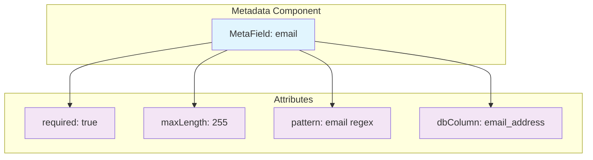

# Attribute Framework

The MetaObjects attribute framework provides a sophisticated system for attaching cross-cutting properties to any metadata component. This system enables rich metadata annotation while maintaining type safety, performance, and consistency across the entire framework.

## Core Concepts

Attributes in MetaObjects serve as **cross-cutting properties** that can be attached to any metadata component (objects, fields, validators, views, etc.) to provide additional information or behavior configuration.

### :material-tag: **What Are Attributes?**

Attributes are **typed metadata properties** that extend the base functionality of metadata components:



### :material-cog: **Attribute Characteristics**

1. **Type-Safe**: Each attribute has a specific data type (string, int, boolean, etc.)
2. **Cross-Cutting**: Can be applied to any metadata component
3. **Constraint-Validated**: Subject to placement and validation constraints
4. **Cacheable**: Optimized for read-heavy access patterns
5. **Serializable**: Can be represented in JSON/XML metadata formats

## Attribute Type System

MetaObjects provides a comprehensive type system for attributes:

### Built-in Attribute Types

```java
// String attributes for text values
StringAttribute dbColumn = new StringAttribute("dbColumn");
dbColumn.setValue("email_address");

// Integer attributes for numeric values
IntAttribute maxLength = new IntAttribute("maxLength");
maxLength.setValue(255);

// Boolean attributes for flags
BooleanAttribute required = new BooleanAttribute("required");
required.setValue(true);

// Double attributes for decimal values
DoubleAttribute scale = new DoubleAttribute("scale");
scale.setValue(2.5);

// Long attributes for large integers
LongAttribute maxValue = new LongAttribute("maxValue");
maxValue.setValue(9999999999L);

// Class attributes for type references
ClassAttribute validatorClass = new ClassAttribute("validatorClass");
validatorClass.setValue(EmailValidator.class);

// Properties attributes for key-value collections
PropertiesAttribute config = new PropertiesAttribute("config");
config.setValue(Map.of("timeout", "30", "retries", "3"));

// String array attributes for multiple values
StringArrayAttribute tags = new StringArrayAttribute("tags");
tags.setValue(new String[]{"user", "contact", "personal"});
```

### DataTypes Enum Integration

Each attribute type is backed by the `DataTypes` enum which provides type safety and conversion capabilities:

```java
public enum DataTypes {
    BOOLEAN(Boolean.class),
    INT(Integer.class),
    LONG(Long.class),
    DOUBLE(Double.class),
    STRING(String.class),
    STRING_ARRAY(String[].class),
    OBJECT(Object.class),
    // ... additional types
}
```

### Type-Safe Value Handling

The attribute system provides comprehensive type-safe value handling:

```java
public class MetaAttribute<T> extends MetaData {
    private T value;
    private DataTypes dataType;

    // Type-safe setters with conversion
    public void setValue(T value) { /* Direct type-safe assignment */ }
    public void setValueAsString(String value) { /* String conversion */ }
    public void setValueAsObject(Object value) { /* Type-safe conversion */ }

    // Type-safe getters with optional support
    public T getValue() { /* Direct typed access */ }
    public String getValueAsString() { /* String representation */ }
    public Optional<T> getValueSafe() { /* Optional wrapper */ }
    public T getValueOrDefault(T defaultValue) { /* Fallback support */ }
}
```

## Inline Attribute Syntax

MetaObjects supports **inline attribute syntax** for concise metadata definition:

### JSON Format (@-prefixed)

```json
{
  "field": {
    "name": "email",
    "type": "string",
    "@required": true,
    "@maxLength": 255,
    "@pattern": "^[\\w._%+-]+@[\\w.-]+\\.[A-Za-z]{2,}$",
    "@dbColumn": "email_address"
  }
}
```

### XML Format (Direct Attributes)

```xml
<field name="email" type="string"
       required="true"
       maxLength="255"
       pattern="^[\w._%+-]+@[\w.-]+\.[A-Za-z]{2,}$"
       dbColumn="email_address" />
```

### Automatic Type Conversion

The parser automatically converts inline attribute values to appropriate types:

```java
// Type conversion examples
"@required": true        → BooleanAttribute(true)
"@maxLength": 255        → IntAttribute(255)
"@scale": 2.5           → DoubleAttribute(2.5)
"@dbColumn": "email"     → StringAttribute("email")
"@tags": ["user", "contact"] → StringArrayAttribute(["user", "contact"])
```

## Attribute Registration System

Attributes use the same provider-based registration system as other metadata types:

### Individual Attribute Registration

```java
public class StringAttribute extends MetaAttribute<String> {
    public static final String SUBTYPE_STRING = "string";

    public static void registerTypes(MetaDataRegistry registry) {
        registry.registerType(StringAttribute.class, def -> def
            .type(TYPE_ATTR).subType(SUBTYPE_STRING)
            .description("String attribute value")
            .inheritsFrom(TYPE_ATTR, SUBTYPE_BASE)  // Inherits from attr.base
        );
    }
}
```

### Provider-Based Registration

```java
public class AttributeTypesMetaDataProvider implements MetaDataTypeProvider {

    @Override
    public void registerTypes(MetaDataRegistry registry) {
        // Register base attribute type first
        MetaAttribute.registerTypes(registry);

        // Register concrete attribute types
        StringAttribute.registerTypes(registry);
        IntAttribute.registerTypes(registry);
        BooleanAttribute.registerTypes(registry);
        DoubleAttribute.registerTypes(registry);
        LongAttribute.registerTypes(registry);
        ClassAttribute.registerTypes(registry);
        PropertiesAttribute.registerTypes(registry);
        StringArrayAttribute.registerTypes(registry);
    }

    @Override
    public int getPriority() {
        return 15; // After fields (10), before validators (20)
    }
}
```

### Service Discovery

```
META-INF/services/com.metaobjects.registry.MetaDataTypeProvider:
com.metaobjects.attr.AttributeTypesMetaDataProvider
```

## Cross-Cutting Attribute Constraints

The attribute system integrates with the constraint framework to enforce placement and validation rules:

### Placement Constraints

Define where attributes can be placed:

```java
// Allow required attribute on any field
PlacementConstraint.allowAttributeOnAnyField(
    "field.required",
    "Any field can be required",
    BooleanAttribute.SUBTYPE_BOOLEAN,
    "required"
);

// Allow maxLength only on string fields
PlacementConstraint.allowAttribute(
    "field.string.maxLength",
    "String fields can have maxLength",
    MetaField.TYPE_FIELD,
    StringField.SUBTYPE_STRING,
    IntAttribute.SUBTYPE_INT,
    "maxLength"
);

// Allow dbColumn on any field for database mapping
PlacementConstraint.allowAttributeOnAnyField(
    "field.database.column",
    "Any field can have database column mapping",
    StringAttribute.SUBTYPE_STRING,
    "dbColumn"
);
```

### Validation Constraints

Validate attribute values:

```java
// Ensure maxLength values are positive
new RangeConstraint(
    "attr.maxLength.positive",
    "maxLength must be positive",
    "attr", "int", "maxLength",
    1, Integer.MAX_VALUE
);

// Validate email pattern format
new RegexConstraint(
    "attr.pattern.valid",
    "Pattern must be valid regex",
    "attr", "string", "pattern",
    "^.+$"  // Basic regex validation
);

// Ensure database column names follow conventions
new RegexConstraint(
    "attr.dbColumn.naming",
    "Database columns must follow snake_case",
    "attr", "string", "dbColumn",
    "^[a-z][a-z0-9_]*$"
);
```

## Common Attribute Patterns

### Database Mapping Attributes

```java
// Database table mapping for objects
StringAttribute dbTable = new StringAttribute("dbTable");
dbTable.setValue("users");

// Database column mapping for fields
StringAttribute dbColumn = new StringAttribute("dbColumn");
dbColumn.setValue("email_address");

// Nullable column specification
BooleanAttribute dbNullable = new BooleanAttribute("dbNullable");
dbNullable.setValue(false);

// Primary key marker
BooleanAttribute isPrimaryKey = new BooleanAttribute("isPrimaryKey");
isPrimaryKey.setValue(true);
```

### Validation Attributes

```java
// Required field marker
BooleanAttribute required = new BooleanAttribute("required");
required.setValue(true);

// String length constraints
IntAttribute minLength = new IntAttribute("minLength");
minLength.setValue(3);

IntAttribute maxLength = new IntAttribute("maxLength");
maxLength.setValue(255);

// Pattern validation
StringAttribute pattern = new StringAttribute("pattern");
pattern.setValue("^[a-zA-Z][a-zA-Z0-9_]*$");

// Numeric range constraints
LongAttribute minValue = new LongAttribute("minValue");
minValue.setValue(0L);

LongAttribute maxValue = new LongAttribute("maxValue");
maxValue.setValue(999999L);
```

### UI Rendering Attributes

```java
// Display label for UI
StringAttribute displayName = new StringAttribute("displayName");
displayName.setValue("Email Address");

// Help text for users
StringAttribute helpText = new StringAttribute("helpText");
helpText.setValue("Enter a valid email address");

// UI component type
StringAttribute uiComponent = new StringAttribute("uiComponent");
uiComponent.setValue("email-input");

// CSS classes for styling
StringArrayAttribute cssClasses = new StringArrayAttribute("cssClasses");
cssClasses.setValue(new String[]{"form-control", "required-field"});

// Display order
IntAttribute displayOrder = new IntAttribute("displayOrder");
displayOrder.setValue(10);
```

### Business Rule Attributes

```java
// Audit trail markers
BooleanAttribute auditable = new BooleanAttribute("auditable");
auditable.setValue(true);

// Security classification
StringAttribute securityLevel = new StringAttribute("securityLevel");
securityLevel.setValue("confidential");

// Business domain classification
StringAttribute domain = new StringAttribute("domain");
domain.setValue("customer-data");

// Retention policy
IntAttribute retentionDays = new IntAttribute("retentionDays");
retentionDays.setValue(2555); // 7 years

// Data source information
StringAttribute dataSource = new StringAttribute("dataSource");
dataSource.setValue("customer-portal");
```

## Working with Attributes

### Adding Attributes to Metadata

```java
// Create a field
MetaField emailField = new StringField("email");

// Add attributes using different methods
emailField.addChild(new BooleanAttribute("required").setValue(true));
emailField.addChild(IntAttribute.create("maxLength", 255));
emailField.addChild(StringAttribute.create("pattern", "^[\\w._%+-]+@[\\w.-]+\\.[A-Za-z]{2,}$"));

// Alternative: Use setMetaAttr convenience method
emailField.setMetaAttr("dbColumn", "email_address");
emailField.setMetaAttr("displayName", "Email Address");
```

### Reading Attribute Values

```java
// Check if attribute exists
if (emailField.hasMetaAttr("required")) {
    boolean isRequired = Boolean.parseBoolean(
        emailField.getMetaAttr("required").getValueAsString()
    );
}

// Type-safe access with fallback
String dbColumn = emailField.findString("dbColumn").orElse(emailField.getName());

// Required access (throws if missing)
int maxLength = Integer.parseInt(emailField.requireString("maxLength"));

// Optional access
Optional<String> pattern = emailField.findString("pattern");
if (pattern.isPresent()) {
    // Use pattern for validation
}
```

### Attribute Iteration

```java
// Get all attributes
List<MetaAttribute> attributes = emailField.getChildren(MetaAttribute.class);

// Filter attributes by type
List<BooleanAttribute> booleanAttrs = emailField.getChildren(BooleanAttribute.class);

// Stream-based processing
emailField.getChildrenStream()
    .filter(child -> child instanceof MetaAttribute)
    .map(child -> (MetaAttribute) child)
    .filter(attr -> attr.getDataType() == DataTypes.STRING)
    .forEach(attr -> processStringAttribute(attr));
```

## Custom Attribute Types

Create domain-specific attribute types for specialized use cases:

### Step 1: Define Custom Attribute

```java
/**
 * Custom attribute for URL values with validation
 */
public class UrlAttribute extends MetaAttribute<String> {
    public static final String SUBTYPE_URL = "url";

    public UrlAttribute(String name) {
        super(SUBTYPE_URL, name, DataTypes.STRING);
    }

    @Override
    public void setValue(String value) {
        if (value != null && !isValidUrl(value)) {
            throw new InvalidAttributeValueException(
                "Invalid URL format: " + value
            );
        }
        super.setValue(value);
    }

    public static void registerTypes(MetaDataRegistry registry) {
        registry.registerType(UrlAttribute.class, def -> def
            .type(TYPE_ATTR).subType(SUBTYPE_URL)
            .description("URL attribute with validation")
            .inheritsFrom(TYPE_ATTR, SUBTYPE_BASE)
        );

        // Add URL-specific validation constraint
        registry.addValidationConstraint(
            new RegexConstraint(
                "attr.url.format",
                "URL must be valid format",
                "attr", SUBTYPE_URL, "*",
                "^https?://[\\w.-]+(:[0-9]+)?(/.*)?$"
            )
        );
    }

    private boolean isValidUrl(String url) {
        try {
            new java.net.URL(url);
            return true;
        } catch (Exception e) {
            return false;
        }
    }

    public static UrlAttribute create(String name, String url) {
        UrlAttribute attr = new UrlAttribute(name);
        attr.setValue(url);
        return attr;
    }
}
```

### Step 2: Register Custom Attribute

```java
public class CustomAttributeProvider implements MetaDataTypeProvider {

    @Override
    public void registerTypes(MetaDataRegistry registry) {
        UrlAttribute.registerTypes(registry);
        // Register other custom attributes...
    }

    @Override
    public int getPriority() {
        return 100; // After core attributes
    }
}
```

### Step 3: Use Custom Attribute

```java
// Add URL attribute to a field
MetaField websiteField = new StringField("website");
websiteField.addChild(UrlAttribute.create("defaultValue", "https://example.com"));

// URL validation happens automatically
UrlAttribute siteUrl = new UrlAttribute("siteUrl");
siteUrl.setValue("https://company.com/products"); // ✅ Valid
// siteUrl.setValue("invalid-url"); // ❌ Throws exception
```

## Performance Considerations

### Attribute Caching

Attributes benefit from MetaObjects' caching strategy:

```java
// Attributes are cached for repeated access
public List<MetaAttribute> getRequiredAttributes() {
    return useCache("getRequiredAttributes()", () -> {
        return getChildren(MetaAttribute.class).stream()
            .filter(attr -> "required".equals(attr.getName()))
            .filter(attr -> Boolean.parseBoolean(attr.getValueAsString()))
            .collect(Collectors.toList());
    });
}
```

### Memory Efficiency

- **Type-safe storage**: Direct typed values instead of string conversion
- **Weak reference caches**: Computed attribute collections can be GC'd
- **Shared constants**: Common attribute names and patterns

### Access Patterns

```java
// ✅ GOOD - Cache expensive computations
private final Map<String, Object> attributeCache = new ConcurrentHashMap<>();

public boolean isRequired() {
    return (Boolean) attributeCache.computeIfAbsent("required",
        key -> hasMetaAttr("required") &&
               Boolean.parseBoolean(getMetaAttr("required").getValueAsString())
    );
}

// ❌ AVOID - Repeated string parsing
public boolean isRequired() {
    return hasMetaAttr("required") &&
           Boolean.parseBoolean(getMetaAttr("required").getValueAsString());
}
```

## Integration with Other Systems

### Schema Generation

Attributes automatically integrate with schema generation:

```java
// JSON Schema generation includes attribute constraints
{
  "type": "object",
  "properties": {
    "email": {
      "type": "string",
      "maxLength": 255,
      "pattern": "^[\\w._%+-]+@[\\w.-]+\\.[A-Za-z]{2,}$"
    }
  },
  "required": ["email"]
}
```

### Code Generation

Attributes drive code generation decisions:

```java
// Mustache template helpers access attributes
{{#hasAttribute 'required'}}@NotNull{{/hasAttribute}}
{{#hasAttribute 'maxLength'}}@Size(max={{getAttribute 'maxLength'}}){{/hasAttribute}}
public String get{{capitalize name}}() {
    return {{name}};
}
```

### Database Mapping

Attributes provide database mapping information:

```java
// ORM integration reads database attributes
String tableName = metaObject.findString("dbTable").orElse(metaObject.getName());
String columnName = metaField.findString("dbColumn").orElse(metaField.getName());
boolean nullable = metaField.findBoolean("dbNullable").orElse(true);
```

## Next Steps

<div class="grid cards" markdown>

-   :material-code-tags:{ .lg .middle } **Inline Attributes**

    ---

    Master the inline attribute syntax for concise metadata

    [:octicons-arrow-right-24: Inline Attributes](inline-attributes.md)

-   :material-shield-check:{ .lg .middle } **Constraints**

    ---

    Understand how attributes integrate with constraints

    [:octicons-arrow-right-24: Constraint Architecture](../constraints/constraint-architecture.md)

-   :material-database:{ .lg .middle } **Metadata Foundation**

    ---

    Learn the core metadata architecture

    [:octicons-arrow-right-24: Metadata Foundation](../metadata-foundation.md)

-   :material-code-braces:{ .lg .middle } **Examples**

    ---

    See working examples of attribute usage

    [:octicons-arrow-right-24: Basic Usage](../../../examples/basic-usage.md)

</div>

---

The attribute framework provides the flexible foundation for enriching metadata with cross-cutting concerns while maintaining type safety, performance, and integration with MetaObjects' sophisticated constraint and caching systems.