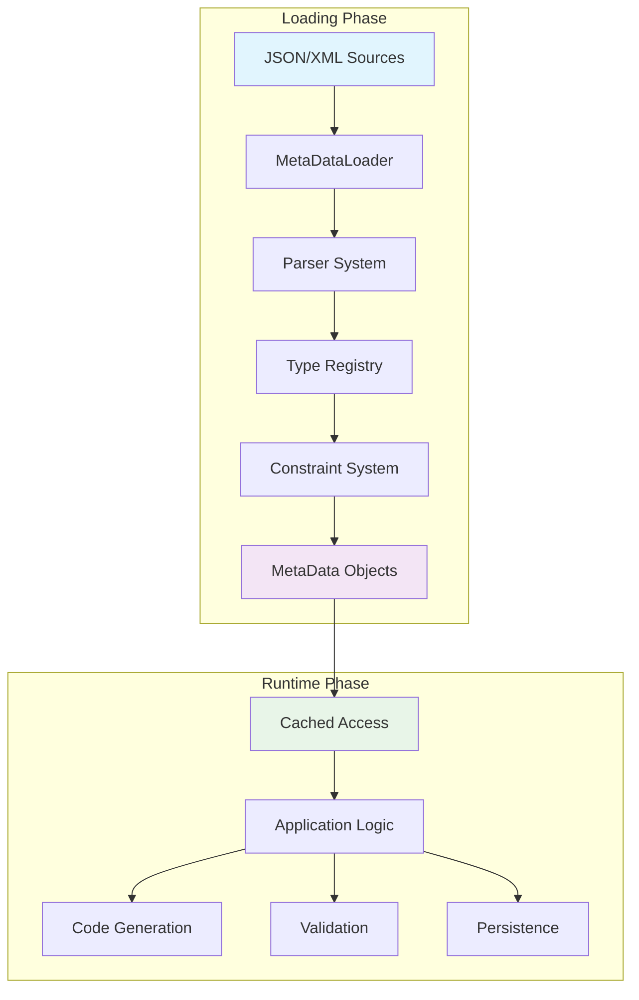
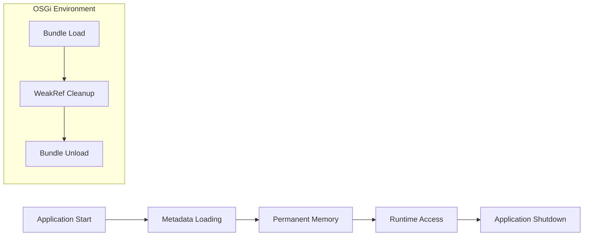

# Metadata Foundation

The metadata module is the heart of the MetaObjects framework, providing the core classes, interfaces, and patterns that everything else builds upon. This guide covers the foundational architecture, design patterns, and key classes that form the basis of MetaObjects.

## Architectural Overview

The metadata module implements a **READ-OPTIMIZED WITH CONTROLLED MUTABILITY** pattern that provides enterprise-grade performance and reliability:



### Key Design Principles

#### :material-memory: **ClassLoader Pattern**
MetaObjects follows the same pattern as Java's `Class` and `Field` reflection system:

- **Load once** during application startup (expensive)
- **Access thousands of times** during runtime (microsecond performance)
- **Permanent memory residence** for application lifetime
- **Thread-safe concurrent access** without synchronization overhead

#### :material-speedometer: **Performance Characteristics**
Understanding these performance expectations is crucial for proper usage:

| Phase | Duration | Operations | Characteristics |
|-------|----------|------------|----------------|
| **Loading** | 100ms-1s | Parse, validate, construct | Heavy processing, one-time cost |
| **Runtime** | 1-10μs | Read, cache lookup | Ultra-fast, concurrent access |
| **Memory** | 10-50MB | Permanent residence | Similar to Class objects |

#### :material-sync: **OSGi Compatibility**
The architecture fully supports OSGi bundle lifecycle:

- **ServiceLoader discovery** for dynamic type registration
- **WeakReference patterns** for proper bundle cleanup
- **Service registry integration** for enterprise environments

## Core Classes

### MetaData: The Foundation Class

All metadata components inherit from the `MetaData` base class:

```java
public class MetaData implements Cloneable, Serializable {
    // Universal attributes that apply to ALL metadata
    public static final String ATTR_NAME = "name";
    public static final String ATTR_TYPE = "type";
    public static final String ATTR_SUBTYPE = "subType";
    public static final String ATTR_PACKAGE = "package";

    // Package separator for hierarchical naming
    public static final String PKG_SEPARATOR = "::";

    // Validation pattern for identifiers
    public static final String VALID_NAME_PATTERN = "^[a-zA-Z][a-zA-Z0-9_]*$";
}
```

#### Core Functionality

**Hierarchical Structure:**
```java
// Parent-child relationships
public void addChild(MetaData child);
public <T extends MetaData> List<T> getChildren(Class<T> childType);
public MetaData getParent();

// Safe navigation
public Optional<MetaData> findChild(String name);
public Stream<MetaData> getChildrenStream();
```

**Attribute Management:**
```java
// Type-safe attribute access
public boolean hasMetaAttr(String name);
public MetaAttribute getMetaAttr(String name);
public Optional<String> findString(String name);
public String requireString(String name);  // Throws if missing
```

**Caching System:**
```java
// High-performance caching with dual strategy
protected <T> T useCache(String key, Supplier<T> supplier);
// Uses ConcurrentHashMap for permanent cache + WeakHashMap for computed values
```

### MetaObject: Object Structure Definitions

`MetaObject` represents the structure of domain objects, similar to how `Class` represents Java classes:

```java
public class MetaObject extends MetaData {
    // Type constants
    public static final String TYPE_OBJECT = "object";
    public static final String SUBTYPE_BASE = "base";

    // Object-specific attributes
    public static final String ATTR_EXTENDS = "extends";
    public static final String ATTR_IMPLEMENTS = "implements";
    public static final String ATTR_IS_INTERFACE = "isInterface";
}
```

#### Usage Patterns

**Basic Object Access:**
```java
// Get object metadata
MetaObject userMeta = loader.getMetaObjectByName("User");

// Explore structure
List<MetaField> fields = userMeta.getChildren(MetaField.class);
List<MetaValidator> validators = userMeta.getChildren(MetaValidator.class);
List<MetaKey> keys = userMeta.getChildren(MetaKey.class);

// Database mapping
if (userMeta.hasMetaAttr("dbTable")) {
    String tableName = userMeta.getMetaAttr("dbTable").getValueAsString();
}
```

**Object Inheritance:**
```java
// Check inheritance relationships
if (userMeta.hasMetaAttr("extends")) {
    String parentName = userMeta.getMetaAttr("extends").getValueAsString();
    MetaObject parentMeta = loader.getMetaObjectByName(parentName);
}

// Interface implementation
if (userMeta.hasMetaAttr("implements")) {
    String[] interfaces = userMeta.getMetaAttr("implements")
        .getValueAsString().split(",");
}
```

### MetaField: Field Definitions

`MetaField` represents properties within objects, analogous to `java.lang.reflect.Field`:

```java
public class MetaField extends MetaData {
    // Type constants
    public static final String TYPE_FIELD = "field";
    public static final String SUBTYPE_BASE = "base";

    // Field-specific attributes
    public static final String ATTR_REQUIRED = "required";
    public static final String ATTR_DEFAULT_VALUE = "defaultValue";
    public static final String ATTR_DEFAULT_VIEW = "defaultView";
}
```

#### Field Type System

**Built-in Field Types:**
```java
// String fields with length and pattern validation
StringField emailField = new StringField("email");
emailField.setMetaAttr("maxLength", "255");
emailField.setMetaAttr("pattern", "^[\\w._%+-]+@[\\w.-]+\\.[A-Za-z]{2,}$");

// Numeric fields with range validation
IntegerField ageField = new IntegerField("age");
ageField.setMetaAttr("minValue", "0");
ageField.setMetaAttr("maxValue", "150");

// Date fields with format specification
DateField createdField = new DateField("createdAt");
createdField.setMetaAttr("format", "yyyy-MM-dd'T'HH:mm:ss.SSS'Z'");
```

**Field Inheritance:**
All concrete field types inherit from `field.base` to get common functionality:

```java
// Type registration with inheritance
registry.registerType(StringField.class, def -> def
    .type(TYPE_FIELD).subType("string")
    .inheritsFrom(TYPE_FIELD, SUBTYPE_BASE)  // Inherits common field behavior
    .optionalAttribute("pattern", "string")
    .optionalAttribute("maxLength", "int")
    .optionalAttribute("minLength", "int")
);
```

### MetaAttribute: Cross-cutting Properties

`MetaAttribute` represents additional properties that can be attached to any metadata component:

```java
public class MetaAttribute extends MetaData {
    // Attribute type system
    public static final String TYPE_ATTR = "attr";

    // Common attribute subtypes
    public static final String SUBTYPE_STRING = "string";
    public static final String SUBTYPE_INT = "int";
    public static final String SUBTYPE_BOOLEAN = "boolean";
}
```

#### Attribute Types

**StringAttribute:**
```java
// Text values with optional pattern validation
StringAttribute dbColumn = new StringAttribute("dbColumn");
dbColumn.setValue("email_address");

// With pattern validation
StringAttribute pattern = new StringAttribute("pattern");
pattern.setValue("^[a-zA-Z][a-zA-Z0-9_]*$");
```

**IntAttribute:**
```java
// Numeric values with range validation
IntAttribute maxLength = new IntAttribute("maxLength");
maxLength.setValue(255);
maxLength.setMetaAttr("minValue", "1");
maxLength.setMetaAttr("maxValue", "65535");
```

**BooleanAttribute:**
```java
// True/false flags
BooleanAttribute required = new BooleanAttribute("required");
required.setValue(true);
```

## Type Registration System

MetaObjects uses a sophisticated provider-based type registration system that eliminates the need for annotations:

### Provider-Based Registration

**Type Provider Pattern:**
```java
public class FieldTypesMetaDataProvider implements MetaDataTypeProvider {

    @Override
    public void registerTypes(MetaDataRegistry registry) {
        // Register field types in controlled order
        StringField.registerTypes(registry);
        IntegerField.registerTypes(registry);
        LongField.registerTypes(registry);
        DateField.registerTypes(registry);
        // ... other field types
    }

    @Override
    public int getPriority() {
        return 10; // After base types (0), before extensions (50+)
    }
}
```

**Service Discovery:**
```
META-INF/services/com.metaobjects.registry.MetaDataTypeProvider:
com.metaobjects.core.CoreTypeMetaDataProvider
com.metaobjects.field.FieldTypesMetaDataProvider
com.metaobjects.attr.AttributeTypesMetaDataProvider
com.metaobjects.validator.ValidatorTypesMetaDataProvider
```

### Type Registration Details

**Individual Type Registration:**
```java
public class StringField extends PrimitiveField<String> {

    public static void registerTypes(MetaDataRegistry registry) {
        registry.registerType(StringField.class, def -> def
            .type(TYPE_FIELD).subType("string")
            .description("String field with length and pattern validation")
            .inheritsFrom(TYPE_FIELD, SUBTYPE_BASE)

            // String-specific attributes
            .optionalAttribute("pattern", StringAttribute.SUBTYPE_STRING)
            .optionalAttribute("maxLength", IntAttribute.SUBTYPE_INT)
            .optionalAttribute("minLength", IntAttribute.SUBTYPE_INT)
        );
    }
}
```

**Benefits of Provider-Based Registration:**
- **No annotation dependencies** - clean class definitions
- **Controlled registration order** - dependencies resolved properly
- **Enhanced extensibility** - plugins use same pattern as core
- **Cross-module support** - types can be registered from any module

### Fluent Constraint System (v6.2.6+)

The revolutionary **AttributeConstraintBuilder** provides elegant, type-safe constraint definition:

**Enhanced Registration with Fluent Constraints:**
```java
public static void registerTypes(MetaDataRegistry registry) {
    registry.registerType(PrimaryIdentity.class, def -> def
        .type(TYPE_IDENTITY).subType(SUBTYPE_PRIMARY)
        .description("Primary identity for object identification")
        .inheritsFrom("identity", "base")

        // Fluent constraint definition with AttributeConstraintBuilder
        .optionalAttributeWithConstraints(ATTR_GENERATION)
           .ofType(StringAttribute.SUBTYPE_STRING)
           .asSingle()
           .withEnum(GENERATION_INCREMENT, GENERATION_UUID, GENERATION_ASSIGNED)

        // Array-based attributes with fluent syntax
        .optionalAttributeWithConstraints(ATTR_FIELDS)
           .ofType(StringAttribute.SUBTYPE_STRING)
           .asArray()
    );
}
```

**Fluent Constraint Benefits:**
- **115+ Comprehensive Constraints** - 57 placement + 28 validation + 30 array-specific
- **Type Safety** - Compile-time checking of constraint definitions
- **Enhanced ConstraintEnforcer** - Attribute-specific validation with precise error reporting
- **Chainable Methods** - Readable constraint configuration with clear intent
- **Universal @isArray Support** - Single modifier eliminates array subtype explosion

## Cache Strategy

MetaObjects uses a sophisticated dual cache strategy for optimal performance:

### Hybrid Cache Architecture

```java
public class HybridCache {
    // PERMANENT CACHE - Strong references for core metadata
    private final Map<String, Object> modernCache = new ConcurrentHashMap<>();

    // COMPUTED CACHE - Weak references for derived calculations
    private final Map<Object, Object> legacyCache =
        Collections.synchronizedMap(new WeakHashMap<>());
}
```

### Cache Usage Patterns

**Cache Access Strategy:**
```java
public <T> T useCache(String key, Supplier<T> supplier) {
    // 1. Fast path - check permanent cache first
    T value = (T) modernCache.get(key);
    if (value != null) return value;

    // 2. Fallback - check computed cache
    value = (T) legacyCache.get(key);
    if (value != null) {
        modernCache.put(key, value); // Promote to permanent if frequently accessed
        return value;
    }

    // 3. Cache miss - compute and store
    value = supplier.get();
    legacyCache.put(key, value); // Weak reference - can be GC'd
    return value;
}
```

### Why WeakHashMap is Essential

The dual cache strategy serves critical architectural purposes:

1. **OSGi Bundle Unloading**: Computed caches get cleaned up when bundles unload
2. **Memory Pressure**: Non-essential computed values can be GC'd and recomputed
3. **Long-Running Applications**: Prevents memory leaks over application lifetime
4. **Dynamic Metadata**: Allows for metadata enhancement without permanent memory growth

## Thread Safety Model

MetaObjects provides thread safety through careful phase separation:

### Loading Phase Synchronization

```java
// LOADING PHASE - Synchronized writes
public synchronized void addChild(MetaData child) {
    // Constraint validation and structural changes
    children.add(child);
    flushCaches(); // Clear derived computations
}
```

### Runtime Phase Lock-Free Access

```java
// RUNTIME PHASE - Lock-free reads
public MetaField getMetaField(String name) {
    // No synchronization needed - data is immutable
    return useCache("getMetaField()", name, this::computeField);
}
```

### Concurrency Design Patterns

1. **Copy-on-Write Collections**: For metadata collections that rarely change
2. **ConcurrentHashMap**: For high-frequency lookup tables
3. **Volatile References**: For immutable object references
4. **Lock-Free Algorithms**: For read-heavy operations after loading

## Memory Management

Understanding MetaObjects' memory model is crucial for proper usage:

### Memory Lifecycle



### Memory Categories

**Permanent Metadata (Strong References):**
- Core MetaData objects (MetaObject, MetaField, etc.)
- Type registry and constraint definitions
- Never garbage collected during application lifetime

**Computed Caches (Weak References):**
- Derived calculations and transformations
- Performance optimization data
- Can be garbage collected under memory pressure

**OSGi Bundle References (WeakReference Pattern):**
- Service registrations and providers
- Bundle-specific computed data
- Automatically cleaned up when bundles unload

## Error Handling and Debugging

MetaObjects provides comprehensive error handling with rich context:

### Exception Hierarchy

```java
// Base exception with metadata context
public class MetaDataException extends Exception {
    private final Optional<MetaDataPath> metaDataPath;
    private final Map<String, Object> context;

    public Optional<String> getOperation();
    public Map<String, Object> getContext();
}

// Specific exception types
public class MetaDataLoadingException extends MetaDataException;
public class ConstraintViolationException extends MetaDataException;
public class TypeRegistrationException extends MetaDataException;
```

### Rich Error Context

```java
// Context-rich exception creation
throw new MetaDataLoadingException(
    "Failed to load metadata from: " + sourceUri,
    Optional.of(MetaDataPath.of("loader", "initialization")),
    Map.of(
        "sourceUri", sourceUri,
        "phase", "loading",
        "availableTypes", registry.getRegisteredTypeNames()
    )
);
```

### Debugging Support

**Debug Logging:**
```java
// Comprehensive debug information
log.debug("Loading metadata from {} with {} registered types",
    sourceUri, registry.getRegisteredTypeNames().size());

// Cache performance metrics
log.trace("Cache hit rate: {}, size: {}",
    cacheHitRate, cacheSize);
```

**Validation Context:**
```java
// Detailed constraint violation information
if (constraintViolation) {
    log.warn("Constraint violation: {} - Available: {}",
        attemptedValue,
        String.join(", ", validValues));
}
```

## Performance Optimization Guidelines

### DO: Optimize for Read Performance

```java
// ✅ GOOD - Cache expensive operations
public List<MetaField> getRequiredFields() {
    return useCache("getRequiredFields()", () -> {
        return getChildren(MetaField.class).stream()
            .filter(field -> field.hasMetaAttr("required"))
            .filter(field -> Boolean.parseBoolean(
                field.getMetaAttr("required").getValueAsString()))
            .collect(Collectors.toList());
    });
}
```

### DON'T: Synchronize Read Operations

```java
// ❌ WRONG - Unnecessary synchronization kills performance
public synchronized MetaField getMetaField(String name) {
    return fieldCache.get(name); // Blocks concurrent reads
}

// ✅ RIGHT - Lock-free reads after loading
public MetaField getMetaField(String name) {
    return fieldCache.get(name); // Concurrent reads
}
```

### DO: Use Appropriate Collection Types

```java
// ✅ GOOD - ConcurrentHashMap for high-frequency lookups
private final Map<String, MetaField> fieldLookup = new ConcurrentHashMap<>();

// ✅ GOOD - WeakHashMap for computed caches
private final Map<Object, Object> computedCache =
    Collections.synchronizedMap(new WeakHashMap<>());
```

## Next Steps

Now that you understand the metadata foundation, explore specific subsystems:

<div class="grid cards" markdown>

-   :material-sitemap:{ .lg .middle } **Type System**

    ---

    Learn about the complete type registration and inheritance system

    [:octicons-arrow-right-24: Type System](type-system.md)

-   :material-shield-check:{ .lg .middle } **Constraint System**

    ---

    Understand validation and constraint enforcement

    [:octicons-arrow-right-24: Constraint Architecture](constraints/constraint-architecture.md)

-   :material-tag:{ .lg .middle } **Attribute System**

    ---

    Explore cross-cutting attribute management

    [:octicons-arrow-right-24: Attribute Framework](attributes/attribute-framework.md)

-   :material-link:{ .lg .middle } **Inheritance**

    ---

    Master metadata inheritance patterns

    [:octicons-arrow-right-24: Inheritance System](inheritance.md)

</div>

---

The metadata foundation provides the rock-solid base that makes MetaObjects' sophisticated features possible. Understanding these patterns is essential for effective use of the framework.